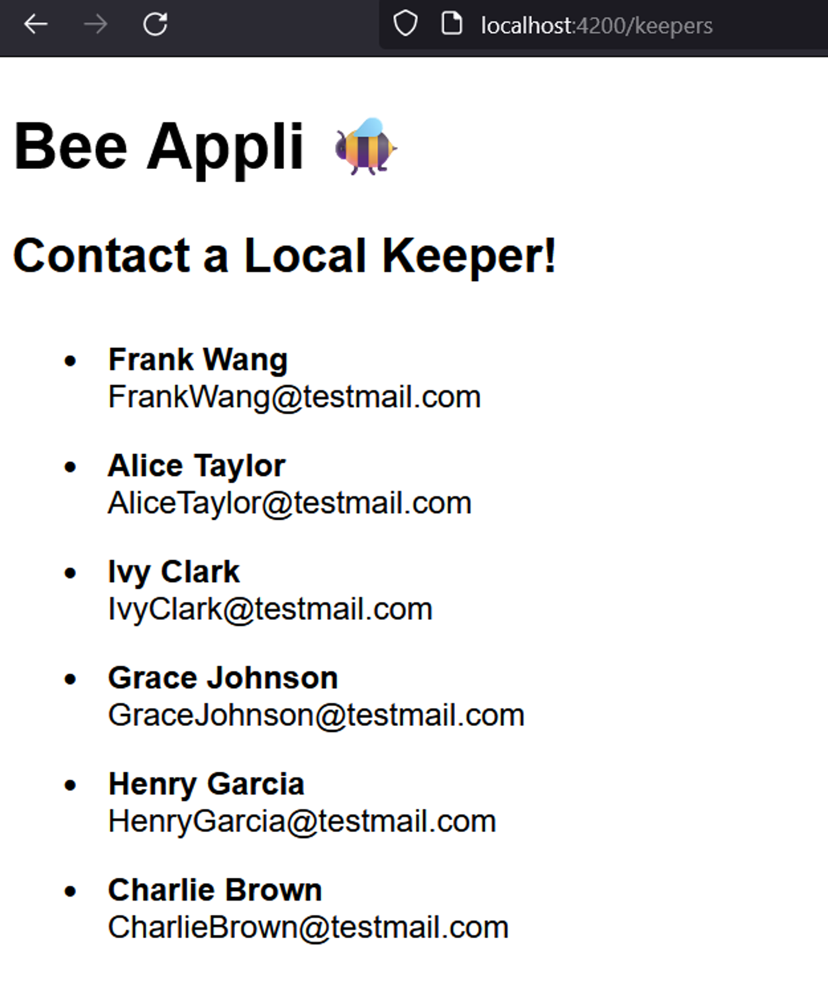

# Bee App Angular Steps

1. Created a new standalone-style Angular app using:
    
    ```tsx
    ng new bee-appli
    ```
    
2. Set up Django to allow cross-domain requests using [this website](https://www.stackhawk.com/blog/django-cors-guide/) as a reference.
    1. pip install django-cors-headers
    2. add 'corsheaders',  to INSTALLED_APPS in the Django app settings.py file.
    3. add 'corsheaders.middleware.CorsMiddleware', to the top of the MIDDLEWARE list in the same file.
    4. add a variable in the settings file to list what IP addresses are allowed to send requests: CORS_ALLOWED_ORIGINS = [ "[http://localhost:4200](http://localhost:4200/)", ]
3. I changed the title in my app.component.ts and deleted the code in the app component template replacing it with just a header of the title to test that everything was working. I ran ng serve to start having a look at the app as it progresses.
4. I decided to start by listing the keepers from the public API so I used ng g c keepers to generate a component called keepers. Let’s be honnest: this component is going to take a lot of inspiration from the Heroes component in Tour of Heroes. No reason to re-invent the wheel, they say. 
5. I added want the keepers to have their own root and not be the homepage, so I set about making routes. In app.routes.ts I added KeepersComponent to the imports and in the routes variable I added a path to the KeepersComponent at “keepers”. This means that, after the next step is complete, the keepers component will display at http://localhost:4200/keepers (for now, obviously a different IP in production).
    
    ```tsx
    import { Routes } from '@angular/router';
    import { KeepersComponent } from './keepers/keepers.component';
    
    export const routes: Routes = [{ path: "keepers", component: KeepersComponent }];
    ```
    
6. Next I added RouterOutlet to the imports in app.component.ts **and** added it to the imports list in the @Components decorator. I then added <router-outlet></router-outlet> to the app.component.html template just under the title. And now the little “Keepers app works!” default should display if we navigate to the keepers address.
7. Before anything interesting can go into this template, we need to communicate with Django and that will require **HTTP requests**. In the app.config.ts I imported provideHttpClient and added it to the list of providers. Notice this list is set up by default to provide router services for the routes we added in app.routes. I love when other people do my dirty work for me.
    
    ```tsx
    import { ApplicationConfig } from '@angular/core';
    import { provideRouter } from '@angular/router';
    
    import { routes } from './app.routes';
    import { provideHttpClient } from '@angular/common/http';
    export const appConfig: ApplicationConfig = {
      providers: [provideRouter(routes), provideHttpClient(),]
    };
    ```
    
8. To get ready to receive keepers from my Django API, I first made a Keeper Interface to get typescript ready to know what my keeper objects should look like. I created a new file in my app folder called keeper-interface.ts .
    
    ```tsx
    export interface Keeper {
        id: number,
        first_name: string,
        last_name: string,
        email: string
    }
    ```
    
9. It’s important to keep getting your data seperate from using your data. Next, I made a get-keepers service to get my list of keepers from my API. I used the command ng g s get-keepers to generate the service. I added imports for Observable and map (and catchError which I am not implementing straight away, but we’ll leave it there to hope future-Me gets the hint and uses it) as well as my Keeper interface. 
    
    ```tsx
    import { Injectable } from '@angular/core';
    import { Observable} from 'rxjs';
    import { HttpClient } from '@angular/common/http';
    import { catchError, map, } from 'rxjs/operators';
    import {
      Keeper
    } from './keeper-interface';
    ```
    
    We need HttpClient to send the get request, so I inject it by adding private http: HttpClient to the constructor. I then created a variable called keepersUrl with the address of my API route to the public info on the bee keepers.
    
    Finally, I made a getKeepers() function which returns an Observable which emits an array of Keeper objects. Which honestly sounds kind of mystical.
    
10. To get the getKeepers() function to run, I imported the GetKeepersService into keepers.component.ts and injected it into the constructor using private keeperService: GetKeepersService(). Next, I created a keepers variable, typed as an array of Keeper objects, and set it to an empy array. I then created an ngOnInit() function in which I could subscribe to getKeepers() and use the result to set my keepers variable value.
    
    ```tsx
    export class KeepersComponent {
      constructor(private keeperService: GetKeepersService) { }
      keepers: Keeper[] = [];
    
      ngOnInit(): void {
        this.keeperService.getKeepers().subscribe(keepers => {
          this.keepers = keepers
        });
      }
    }
    ```
    
11. At first, I didn’t know how I would extract the keepers from the API response because the JSON looks like this:
    
    ```json
    {
        "count": 6,
        "next": null,
        "previous": null,
        "results": [
            {
                "public_beekeeper_info": 3,
                "public_beekeeper_info_details": {
                    "first_name": "Frank",
                    "last_name": "Wang",
                    "email": "FrankWang@testmail.com"
                }
            },
            {
                "public_beekeeper_info": 4,
                "public_beekeeper_info_details": {
                    "first_name": "Alice",
                    "last_name": "Taylor",
                    "email": "AliceTaylor@testmail.com"
                }
            }, ...
        ]
    }
    ```
    
    So I first used a pipe to tap into the response and console log it and map to return an empty array (tap had to be included in the imports from rxjs/operators). This let me see in the console that the request had worked (🎶*there can be miracles, when you belieeeeve*🎶) and confirm that the format was the same as what my Django page was indicating. I figured I needed map() to parse out the result, but I wasn’t sure how it would work, so I consulted the Oracle ie ChatGPT and got the following result:
    
    ```tsx
    getKeepers(): Observable<Keeper[]> {
    
        return this.http.get<any>(this.keepersUrl).pipe(
          map((response) => {
            return response.results.map((beekeeperInfo: any) => ({
              id: beekeeperInfo.public_beekeeper_info,
              first_name: beekeeperInfo.public_beekeeper_info_details.first_name,
              last_name: beekeeperInfo.public_beekeeper_info_details.last_name,
              email: beekeeperInfo.public_beekeeper_info_details.email,
            }));
          })
        );
      }
    ```
    
    So, what map does is take the response that was given and transform it by mapping each element of response.results (where our keeper details are, see the JSON above!) with the given function. The function names each element beekeeperInfo and creates an object with each of the elements required for a keeper: id, first name, last name, and email. It uses dot notation to refer to the right attributes in the JSON. I’m not sure using any for a type is a best practice, but it works for now. 
    
    I’m going to try to display hive information next and write my map all by myself like it’s 2022./
    
12. Now I could use a for loop in my Keepers component template to read the list of keepers and display their information.
    
    ```html
    <h2>Contact a Local Keeper!</h2>
    <ul>
        @for(keeper of keepers; track keeper.id){
        <li><span class="name">{{keeper.first_name}} {{keeper.last_name}}</span>
            <span class="email">{{keeper.email}}</span>
        </li>
        }
    </ul>
    ```
    
    I added a little CSS putting fonts for titles and body text in the general CSS file and using the component specific css file to add a little padding to my list elements and set the name and email spans to block display. And now when I navigate to localhost:4200/keepers I get this: 
    
    
    
    Which honestly makes me a little emotional. Must be the fatigue. 🥲

    ### P2 on paginating the hives to come.